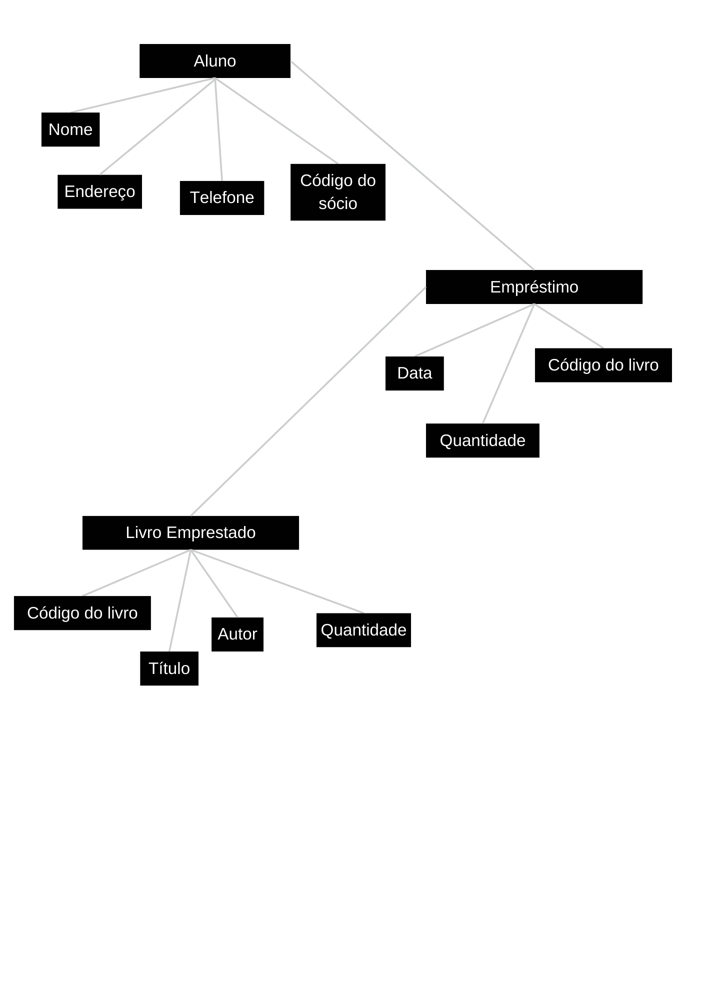

# der-dd
Entrega da atividade DER Biblioteca feita por **Lucas Menegon e Eloá Florêncio**

## Dicionário de Dados

### Entidade: Item
| Atributo            | Tipo       | Descrição                               |
|---------------------|------------|-----------------------------------------|
| `codigo`            | int        | Código único do item                    |
| `titulo`            | varchar    | Título do item                          |
| `autor`             | varchar    | Autor do item                           |
| `qtd_estoque`       | int        | Quantidade disponível em estoque        |

### Entidade: Sócio
| Atributo            | Tipo       | Descrição                               |
|---------------------|------------|-----------------------------------------|
| `id_socio`          | int        | Identificador único do sócio            |
| `nome`              | varchar    | Nome do sócio                           |
| `endereco`          | varchar    | Endereço do sócio                       |
| `telefone`          | varchar    | Telefone de contato do sócio            |

### Entidade: Empréstimo
| Atributo            | Tipo       | Descrição                               |
|---------------------|------------|-----------------------------------------|
| `num_emprestimo`    | int        | Número único do empréstimo              |
| `data`              | date       | Data em que o empréstimo foi realizado  |
| `id_socio`          | int        | ID do sócio que realizou o empréstimo   |

### Entidade: Item_Emprestado
| Atributo            | Tipo       | Descrição                               |
|---------------------|------------|-----------------------------------------|
| `num_emprestimo`    | int        | Número do empréstimo associado          |
| `codigo_item`       | int        | Código do item emprestado               |
| `qtd_emprestada`    | int        | Quantidade de itens emprestados

